# ⭐ Do GitHub Stars Reflect Software Quality?

## Overview

GitHub stars are commonly used as a quick signal of a repository’s popularity and, implicitly, its quality. Developers often rely on star counts when choosing libraries or tools. However, stars are a **social metric** and may be influenced by visibility, timing, or hype rather than by actual engineering quality.

This project investigates the following question:

> **Do GitHub stars reflect measurable software quality?**

To answer this, I collected my own dataset using the GitHub REST API and compared repository popularity with observable indicators of software quality.

---

## Code Structure

The project is organized into three main folders:

**`src/`** - Data collection and processing scripts:
- `collect_API.qmd`: Fetches repository data from GitHub Search API
- `extract_quality_metrics.qmd`: Analyzes repository structure for quality indicators

**`data/`** - Raw and processed datasets:
- `raw/repos_raw.json`: Original API responses (unmodified)
- `processed/cleaned_data.qmd`: Data cleaning and feature engineering
- `processed/repos_clean.csv`: Cleaned repository metadata
- `processed/repos_with_quality.csv`: Final dataset with quality metrics

**`notebooks/`** - Analysis and visualization:
- `eda_quality_vs_popularity.qmd`: Exploratory data analysis and findings

---

## Requirements & Setup

**Prerequisites:**
- Python 3.8+
- GitHub personal access token
- Required packages: `requests`, `pandas`, `matplotlib`, `seaborn`

**Setup:**
1. Set GitHub token as environment variable: `export GITHUB_TOKEN=your_token_here`
2. Install packages: `pip install requests pandas matplotlib seaborn`

---

## How to Run

Execute files in this order:

1. **Data Collection**: Run `src/collect_API.qmd` to fetch repository data
2. **Data Cleaning**: Run `data/processed/cleaned_data.qmd` to process raw data
3. **Quality Extraction**: Run `src/extract_quality_metrics.qmd` to add quality indicators
4. **Analysis**: Run `notebooks/eda_quality_vs_popularity.qmd` for visualizations and findings

---

## Dataset

Custom dataset built using the GitHub REST API:
- **Size:** 30 Python repositories
- **Selection:** Top-starred repositories 
- **Data source:** GitHub Search and Contents APIs
- **Type:** Public repositories only

---

## Data Collection

- Data was collected using the **GitHub REST API**
- Authentication was done via a **personal access token** to increase request limits
- Full metadata for each repository was retrieved and stored

**Collected metadata includes:**
- Repository name and URL  
- Stars, forks, and watchers  
- Creation date and last update date  
- Declared programming language  
- Issue and contributor information  

The complete API responses were stored as **raw JSON files** and left unmodified to ensure reproducibility.

---

## Reproducibility and Ethics

- All data is **publicly available**
- No personal or sensitive information was collected
- Raw data is stored separately from processed data
- All transformations are deterministic and documented

This ensures that the analysis can be independently reproduced and verified.

---

## Defining Software Quality

Software quality is not directly measurable through a single variable. Since GitHub does not provide a built-in quality metric, this project uses **proxy indicators** to operationalize software quality.

The goal is not to fully capture “true” quality, but to construct a **transparent and reproducible approximation** that allows comparison across repositories.

---

## Quality Metrics

Software quality measured using binary indicators (0/1):
- **README file** presence
- **License file** presence  
- **Test directory** presence
- **CI configuration** (`.github/workflows` folder)

These create a **composite quality score (0-4)**.  

---

## Data Cleaning and Feature Engineering

The raw GitHub API responses consist of nested JSON objects and are not suitable for direct analysis.

Processing steps included:
- Selecting only relevant variables  
- Flattening the data into a tabular structure  
- Computing time-based features such as:
  - Repository age  
  - Days since last update  

### Missing Data Handling

- Missing categorical values were labeled as **"Unknown"**
- Numeric popularity metrics were not imputed  
- Raw values were preserved to maintain data integrity  

---

## Extracting Quality Indicators

Additional quality indicators were extracted using the **GitHub Contents API** by inspecting each repository’s root directory.

Binary variables were created for:
- README file  
- License file  
- Test directory  
- CI configuration  

These indicators were merged with the cleaned dataset to create the final analysis-ready dataset.

---

## Key Findings

- **Weak positive correlation** between quality score and GitHub stars
- Repositories **without tests** show wide popularity variance (including viral projects)
- Repositories **with tests** have more consistent, moderate popularity  
- Higher quality scores associate with **stable popularity**, not viral success
- Social factors often drive extreme popularity more than engineering practices  

---

## Results

### Dataset Overview
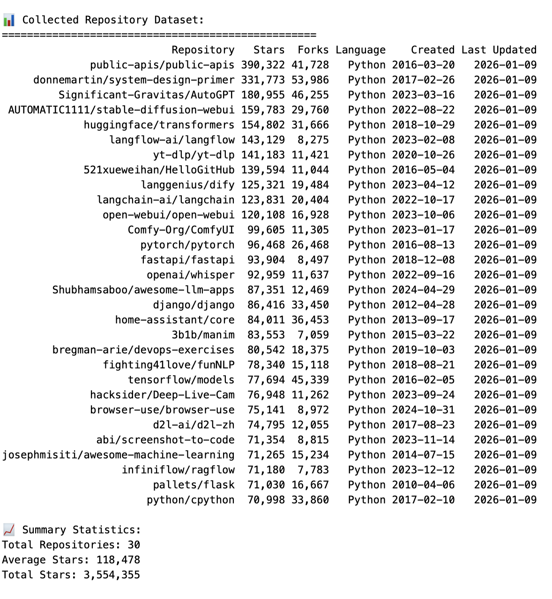

### Data Processing Pipeline

**Data Cleaning Results:**
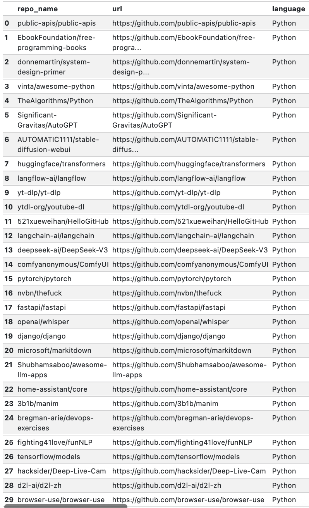

**Missing Data Analysis:**
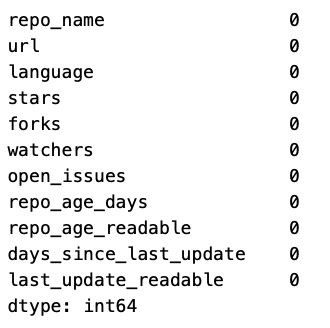

### Quality Metrics Extraction

**Binary Quality Indicators:**
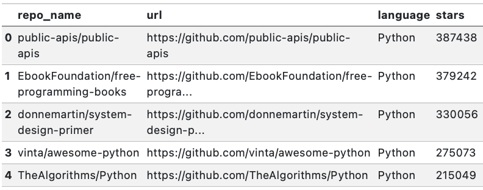
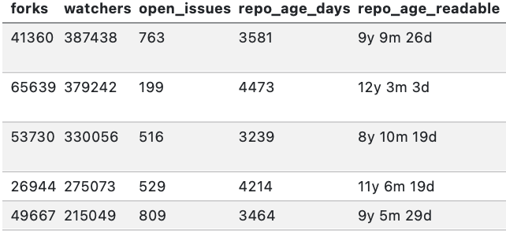
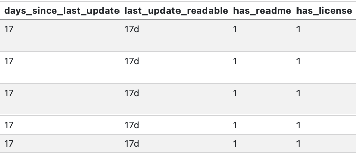
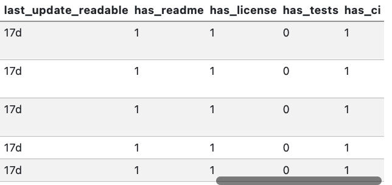

### Popularity vs Quality Analysis

**Stars by Test Presence:**
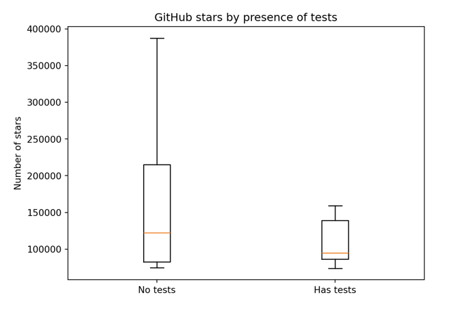

**Stars by README Presence:**
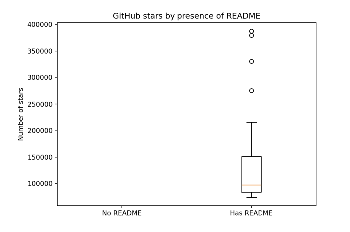

**Stars by License Presence:**
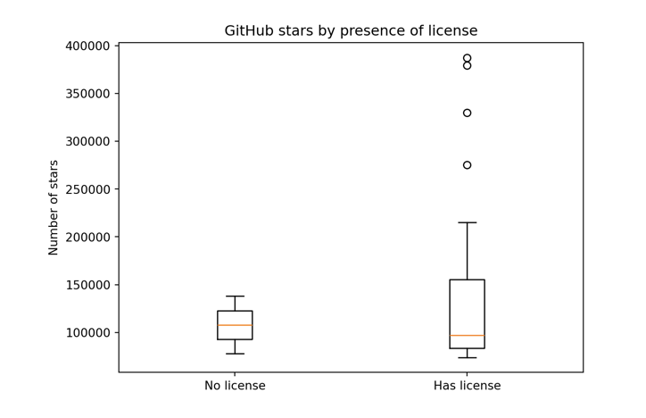

**Stars by CI Configuration:**
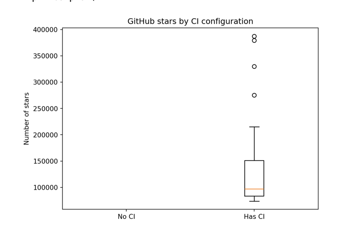

**Overall Quality Score Analysis:**
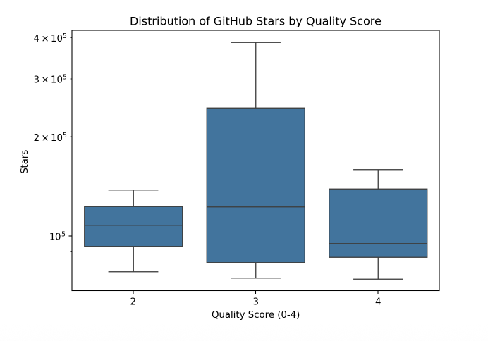

---

## Conclusion

GitHub stars do **not** reliably reflect software quality.

While some quality indicators are more common among popular repositories, high visibility is often driven by social and contextual factors rather than by strong engineering practices. Repositories that follow better engineering practices tend to achieve **consistent popularity**, not necessarily viral success.

---

## Limitations

- Small sample size  
- Proxy-based quality metrics  
- No causal inference  

Despite these limitations, the project provides a **reproducible framework** for critically evaluating popularity signals in open-source software.
